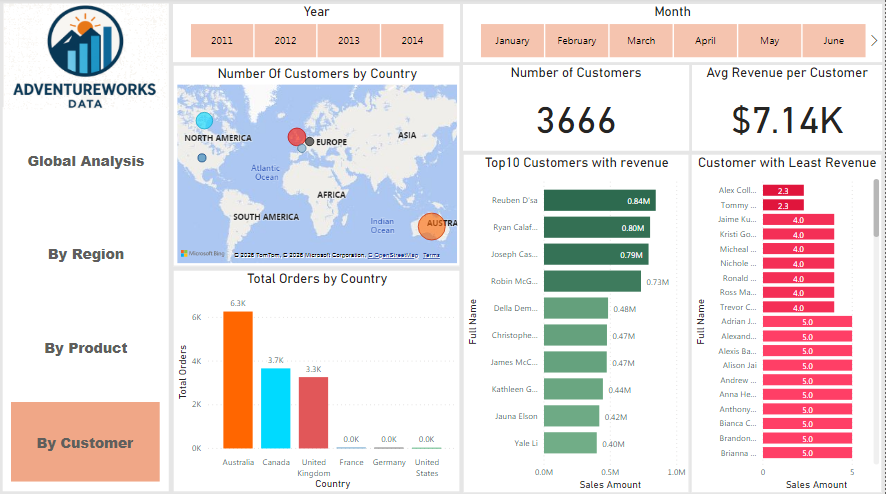
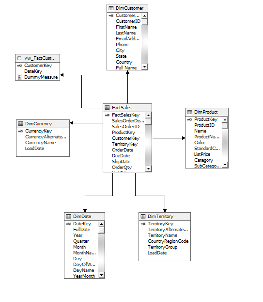

# PowerBI Sales Dashboard Project

## Overview

This project demonstrates an end-to-end Business Intelligence solution:

- ETL process implemented in SSIS
- Star schema data warehouse design
- SSAS cube development
- MDX KPI calculations
- Power BI dashboard using Live Connection to the cube

## Technologies Used
- SSAS
- MDX
- Power BI

## Project Goals
- Sales performance analysis
- KPI design
- Data visualization

## Status
🚧 Sample portfolio project
## Dashboard Preview

### Global Overview

### Regional Analysis

### Product Analysis

### Customer Analysis

## SSIS Package Design

## SSAS Cube Structure

## Key Performance Indicators (KPIs)

- **Profit Margin**: Calculated as Profit / Sales to evaluate overall profitability.
- **Sales Growth**: Year-over-Year growth analysis using MDX calculations.
- **Customer Analysis**: Performance segmented by customer dimension.

### Regional Performance Analysis

- Interactive Region slicer filters cube data dynamically.
- AOV is visualized using an Area Chart to show yearly trends.
- Dashboard is built using Live Connection to SSAS, ensuring real-time cube-driven analytics.
